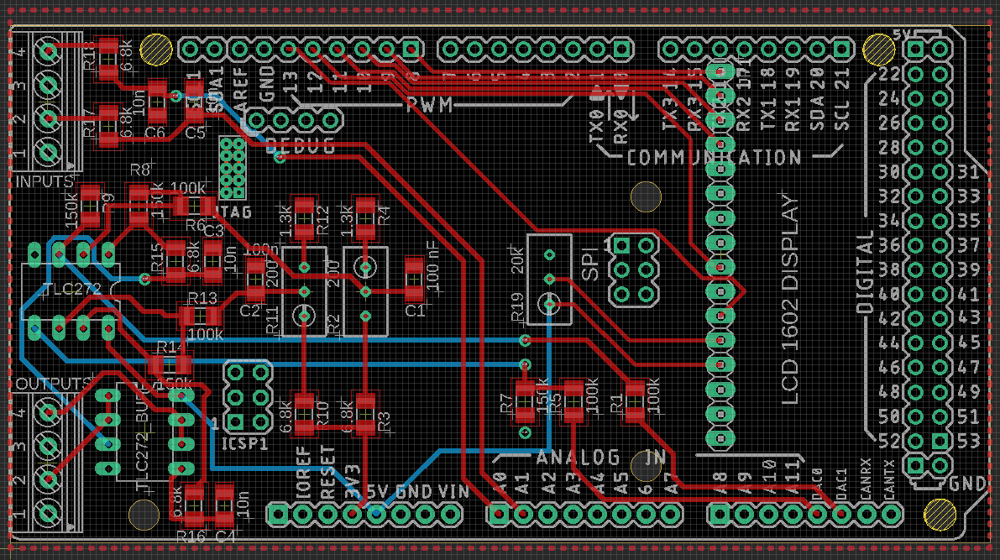
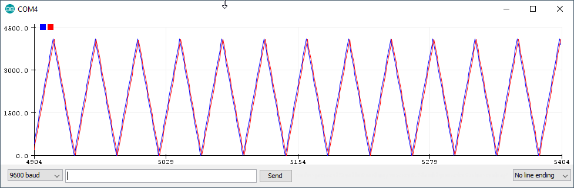
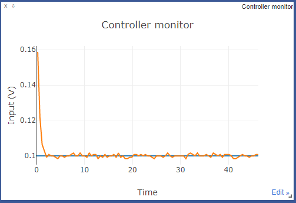
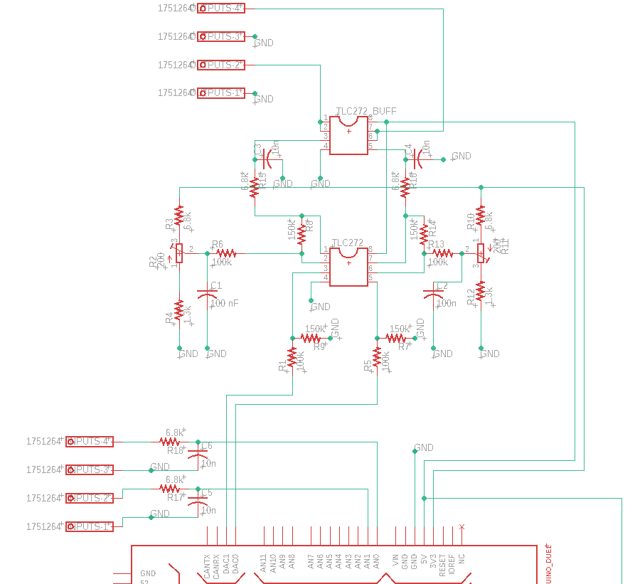

# JPA cancellation PID controller

This repository contains Arduino code built on top of an existing Arduino PID library, with the main 
purpose of minimizing one or two controller input signals from a standard microwave interferometry setup. 
The controller outputs (either one or two) control a voltage controlled attenuator and a voltage controlled phase shifter. 

## Hardware
The necessary hardware for this project is listed below
- Arduino Due, connected to USB port of the computer: this Arduino is better suited for PID control since it has two dedicated DACs outputting a maximum voltage of 3.3 V.
- Voltage controlled phase shifter: we are using the following evaluation board [Qorvo CMD297P34](https://www.custommmic.com/cmd297p34-phase-shifter/).
    This board works for microwave signals in the range of 5-18 GHz and has a modest insertion loss of 3.2 dB. 
- Voltage controlled attenuator: we are using the following evaluation board [IDT F2250 EVB](https://www.mouser.com/datasheet/2/698/IDT_F2250_DST_20170130-1712745.pdf). 
    This board is specified for microwave signals up to 6 GHz and has a tuning range of up to -35 dB with just a modest control voltage of 2V.
- Arduino Due shield with LD1602 display. The shield board layout is shown below. For more information on the contents and functioning of this board, 
please check the section below, and click [here](https://oshpark.com/shared_projects/RkL3pm7k) to order PCBs.

. 

## Uploading the code to the Arduino
### Getting the Arduino IDE set up
The Arduino code has just two dependencies: `PID` and `LiquidCrystal`. `LiquidCrystal` should come with the Arduino IDE, but the `PID` library needs to be installed manually. 
To get started, first clone the `PID` Arduino library from [this](https://github.com/br3ttb/Arduino-PID-Library) link. If you're using the 
Arduino IDE, it's easiest to download the `.zip` file and add the library to Arduino from the menu. 

If you've never connected to an Arduino Due before, you may have to install board software as well. This is also easy in the 
Arduino IDE. Just search for "Due" and install the board software.

### Connecting the board
The Arduino Due has two USB ports: a native USB port and a programming port. To upload the sketch, make sure you connect the
Arduino to the programming port, which is located closest to the DC plug. Once connected open the Arduino IDE's Serial monitor. 
The default state after uploading the code is a voltage ramp with parameters that are controlled in the top part of the script.

## Operating the controller from the serial plotter
To use the Arduino serial plotter interfact, first check that  `use_serial_plotter = True` in `jpa_cancellation_pid_controller.ino`.
Note: by default this variable is set to `false`, to smoothen communication over serial with the python interface (next section).

Once a successful connection has been established, open the serial plotter and you will see a ramp pattern displayed. 
The blue and red traces are the measured controller input and the DAC output setting. The y-axis ranges from 0 to 4095 which corresponds to 0 and 3.3V, respectively. 
In the particular case displayed below, we see that the blue and red traces closely follow each other, because we shorted PID output with the 
controller input. In a general experimental setting the output and input may not follow each other (perfectly); this depends on the system transfer function.


One can supply the following commands to control: 
#### Toggle the DAC ramping
- `R` : Depending on the current state of the controller, this command switches to ramping the DAC, or switches back to closed-loop operation.
#### Set a setpoint
- `Sxxxx` : Set a setpoint for closed-loop operation. The controller will attempt to adjust the DAC output in such a way that the controller input equals the setpoint. `xxxx` is a placeholder for four digits and must be in the range `0000` - `4095`.
#### Take manual control of the DAC output
- `Mxxxx` : Switches to open loop operation and sets the DAC output to bit value `xxxx`, where `xxxx` is the DAC output bit value, which can range from `0000` (0.0 V) to `4095` (3.3 V)

#### Set PID parameters
- `Pxxxx` : Set the proportional control of the PID loop. `xxxx` is a four character float, which can range from `0.01` to `9999`. 
- `Ixxxx` : Set the integral control of the PID loop. `xxxx` is a four character float (see formatting for P).
- `Dxxxx` : Set the derivative control of the PID loop. `xxxx` is a four character float (see formatting for P).

## Using the supplied python driver
The PID controller can also be controlled over serial with the python driver, see `pid.py`. The requirements are 
- `tabulate` : tool to print settings neatly in a table format.
- `tqdm` : for showing update as a progress bar.
- `pyserial`: for communication over USB.
- `visdom`: used for plotting the input and output in real time.

To get started install the packages above using pip, and make sure to set `use_serial_plotter = False` in `jpa_cancellation_pid_controller.ino`. 
Uploade the code to the Arduino. Then, fire up a visdom server:

   ```python -m visdom.server ```

and navigate to `http://localhost:8097`. Open the jupyter notebook. This notebook allows you to change the same settings 
as with the serial plotter. You can track the input or output of the controller using the visdom server. Below we show a plot
of the input voltage in closed-loop operation after changing the setpoint to 0.1 V. 



## Circuit details
Below we show part of the schematic which links the inputs to the outputs. Firstly, there are two pairs of inputs (lower left corner), 
which have a single stage low-pass RC-filter and then connect to Analog inputs 0 and 1 of the Arduino Due. The controller
output are DAC0 and DAC1 of the Arduino Due (output range 0.55 - 2.75 V), which pass through a summing amplifier, RC-filter and a buffer before arriving at the 
output on the top of this schematic. The summing amplifier aims to scale the Arduino DAC output to 0.0-3.3 V. 
.

### Circuit component list
All SMD resistors and capacitors are 1206 for convenience of soldering, unless noted otherwise.
- 4x [resistor, 100 kΩ](https://www.digikey.com/product-detail/en/yageo/RC1206FR-07100KL/311-100KFRCT-ND/731439), ±1%, ¼ W
- 4x resistor, 150 kΩ, ±1%, ¼ W
- 2x resistor, 1.3 kΩ, ±1%, ¼ W
- 6x resistor, 6.8 kΩ, ±1%, ¼ W
- 2x [Rp resistor trimmer](https://www.digikey.com/product-detail/en/bourns-inc/3296W-1-201LF/3296W-201LF-ND/1088049), 200 Ω
- 4x [capacitor, 100 nF](https://www.digikey.com/product-detail/en/kemet/C1206C104M5RACTU/399-1248-1-ND/411523), ceramic
- 4x capacitor, 10 nF, ceramic
- 2x TLC272 opamp (includes 2 per package)
- 2x [four terminal headers](https://www.digikey.com/products/en/connectors-interconnects/terminal-blocks-wire-to-board/371?k=&pkeyword=&sv=0&pv89=11374&sf=0&FV=-5%7C21372%2C-8%7C371&quantity=&ColumnSort=0&page=1&pageSize=25)
- 1x [LCD1602 display](https://www.digikey.com/product-detail/en/lumex-opto-components-inc/LCM-S01602DTR-M/67-1781-ND/469805)

